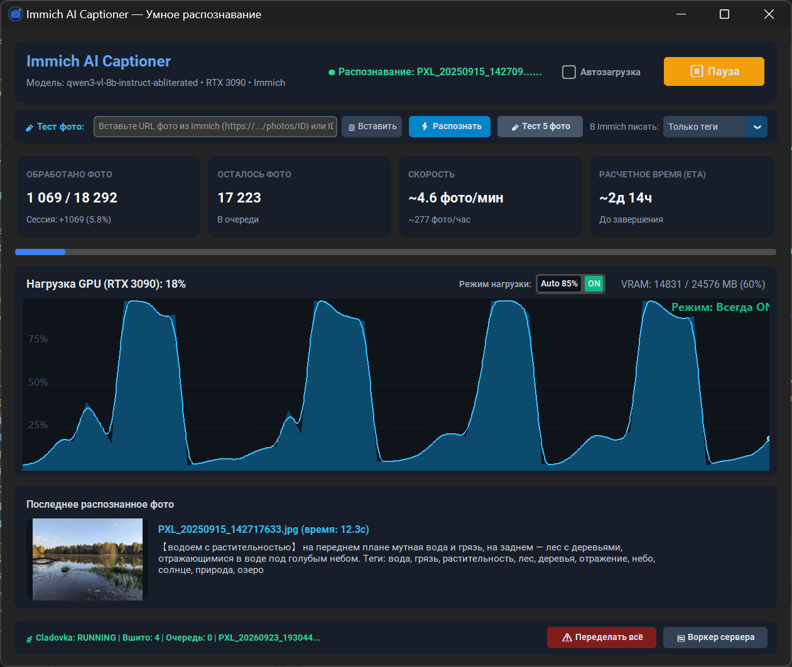

# 📷 Immich AI Captioner & Metadata Sync

> **Automated AI scene captioning, semantic keyword tagging, and permanent IPTC/XMP metadata embedding for [Immich](https://immich.app/) using local Vision LLMs (LM Studio, Ollama, Qwen-VL) and ExifTool.**
>
> 🇷🇺 **Умное AI-распознавание фото, генерация точных тегов и вшивание метаданных IPTC/XMP для Immich с помощью локальных Vision LLM (Qwen-VL) и ExifTool.**

[](LICENSE)
[](https://www.python.org/)
[](https://immich.app/)
[](https://github.com/TomSchimansky/CustomTkinter)
[](https://exiftool.org/)
[](#-internationalization-i18n)
[](https://github.com/SaidAuita/Immich-AI-Captioner/releases)

[📖 Читать документацию на русском языке (Russian version)](README_ru.md) | [📦 Download Ready-to-Run .EXE](https://github.com/SaidAuita/Immich-AI-Captioner/releases)

---

<p align="center">
  
</p>

---

## 🌟 Why Immich AI Captioner?

[Immich](https://immich.app/) is by far the best self-hosted photo management system. However, its native CLIP search and facial clustering have notable limitations:
1. **Fuzzy Search Results**: Searching for specific multi-word attributes, locations, or distinct objects often returns noisy results.
2. **Metadata Trapped in the Database**: All tags and descriptions exist solely within Immich's PostgreSQL database. If your database ever corrupts or you migrate photo platforms, all metadata is permanently lost.

### The Solution:
* **Deep Scene Understanding**: Modern Vision LLMs (e.g., `Qwen2.5-VL-7B`, `Qwen3-VL-8B`) generate 5–15 precise nouns/tags, clean headlines, and extract readable text (OCR).
* **Permanent Source of Truth**: A background ExifTool worker embeds standard metadata directly into image files (`IPTC:Keywords`, `XMP-dc:Subject`, `XMP-photoshop:Headline`), and into companion `.xmp` sidecars for RAW images and videos. Your metadata remains fully searchable in Adobe Lightroom, Bridge, DigiKam, ACDSee, and Windows Explorer forever.
* **100% Private & Local**: Zero cloud dependencies, zero external subscriptions. All AI inference runs locally on your own GPU.

---

## 🖥️ Modern Dashboard

The application features a sleek dark-themed GUI built with **CustomTkinter**:
- **Real-Time GPU Load & VRAM Graphs**: Live telemetry with configurable throttling limits.
- **`Auto 85%` vs `ON` Mode Switcher**:
  - `Auto 85%`: Automatically pauses processing if your GPU exceeds 85% utilization (giving priority to 3D games or rendering).
  - `ON`: Runs full throttle continuously without any pauses.
- **Batch Speed & Accurate ETA Calculation**: Live metrics tracking photos per minute/hour.
- **One-Click Library Re-Processing**: Redo your entire collection from scratch or process only newly uploaded assets.
- **Single-Photo & 5-Photo Test Runners**: Inspect recognition results directly from the UI before applying them to your entire library.
- **Tray Minimized Mode**: Runs silently in the Windows system tray with quick-toggle controls.

---

## 🏗️ Architecture & Deployment Modes

Immich AI Captioner supports two deployment architectures:

```
─────────────────────────────────────────────────────────────────────────────
MODE 1: STANDALONE (DIRECT CLIENT) — Ideal for single PC or unified LAN
─────────────────────────────────────────────────────────────────────────────

[ Windows PC / Laptop with GPU ]
     │
     ├─► 1. ImmichCaptioner.exe connects directly to Immich REST API
     ├─► 2. Queries local VLM (LM Studio / Ollama via OpenAI-compatible API)
     ├─► 3. Writes tags and descriptions directly to Immich (/api/tags, /api/assets)
     └─► 4. (Optional) Drops metadata jobs to local/remote DropSync ExifTool queue


─────────────────────────────────────────────────────────────────────────────
MODE 2: DISTRIBUTED (CLUSTER) — Ideal for Server/NAS + Powerful GPU Workstation
─────────────────────────────────────────────────────────────────────────────

[ Home Server / NAS with Immich ]          [ Workstation with RTX 3080/3090/4090 ]
           │                                                  │
           ├─► coordinator.py (cron / service)                │
           │   Fetches unprocessed assets & puts              │
           │   preview images into shared SMB/NFS folder      │
           │   (\\\\NAS\\CaptionQueue\\In\\)                   │
           │                                                  │
           │                               ◄──────────────────┤
           │                       ImmichCaptionWorker.exe    │
           │                       Pulls batches from In/,    │
           │                       runs Qwen-VL in LM Studio, │
           │                       writes results to Out/     │
           │                                                  │
           │◄─────────────────────────────────────────────────┤
           ▼
 apply_metadata.py (systemd daemon on Server)
 Reads Out/, writes IPTC/XMP into original files
 on server storage via ExifTool, updates stats.json
```

---

## ⚡ Quick Start

### 1. Requirements
- **Immich**: Running instance with an API Key ([Immich documentation](https://immich.app/docs/features/command-line-interface#obtain-the-api-key)).
- **Vision LLM Server**: [LM Studio](https://lmstudio.ai/) or [Ollama](https://ollama.ai/) running on your GPU machine.
  - Recommended models: `qwen2.5-vl-7b-instruct` or `qwen3-vl-8b-instruct`.
  - Start local server at `http://localhost:1234/v1` (LM Studio) or `http://localhost:11434/v1` (Ollama).

### 2. Standalone Mode Installation

1. Download the latest `ImmichCaptioner.exe` from [Releases](https://github.com/SaidAuita/Immich-AI-Captioner/releases).
2. Copy `config.example.json` to `config.json` next to the `.exe`:
   ```json
   {
     "immich": {
       "url": "http://your-immich-server:2283",
       "api_key": "YOUR_IMMICH_API_KEY"
     },
     "lm_studio": {
       "url": "http://localhost:1234/v1",
       "model": "qwen2.5-vl-7b-instruct"
     },
     "throttling": {
       "mode": "auto_85",
       "max_gpu_util_percent": 85
     }
   }
   ```
3. Run `ImmichCaptioner.exe`. Click **▶ Start**!

---

## ⚙️ Configuration Reference

| Parameter | Type | Default | Description |
| :--- | :--- | :--- | :--- |
| `immich.url` | string | `http://localhost:2283` | Base URL of your Immich instance |
| `immich.api_key` | string | - | Immich user API key |
| `immich.thumbnail_size` | string | `preview` | Image size passed to VLM (`preview` or `thumbnail`) |
| `lm_studio.url` | string | `http://localhost:1234/v1` | OpenAI-compatible endpoint |
| `lm_studio.model` | string | `qwen2.5-vl-7b-instruct` | Active model identifier in LM Studio/Ollama |
| `immich_description_mode` | string | `tags_only` | What to write to Immich description: `tags_only`, `title_and_tags`, `full` |
| `throttling.mode` | string | `auto_85` | `auto_85` (pauses if GPU > 85%) or `always_on` (continuous) |
| `throttling.max_gpu_util_percent` | int | `85` | GPU threshold for auto mode |
| `metadata_queue.enabled` | bool | `false` | Enable output to ExifTool queue directory |

---

## 🌐 Internationalization (i18n)

The interface supports multiple languages out of the box. You can switch between **English** and **Русский** directly from the header toggle `[ EN | RU ]`.

Translations are stored in clean JSON files under `locales/`:
- `locales/en.json` — English (Default)
- `locales/ru.json` — Русский

---

## 🛠️ Building From Source

```bash
# Clone the repository
git clone https://github.com/SaidAuita/Immich-AI-Captioner.git
cd Immich-AI-Captioner

# Install dependencies
pip install -r requirements.txt

# Run Standalone GUI
python ui_app.py

# Run Network Worker GUI
python ui_worker.py

# Compile Windows Executables via PyInstaller
pyinstaller ImmichCaptioner.spec --noconfirm
```

---

## 🛠️ Other Projects

**[Free Automation Tools & Utilities](https://ph-cu-s.com/tools)**
* Free open-source scripts, extensions, and desktop utilities for Adobe Illustrator, InDesign, Photoshop, and Windows performance optimization.

**[RyzenQuiet PRO](https://github.com/SaidAuita/RyzenQuietPro)**
* Lightweight hardware HUD monitor, acoustic fan controller, and CPU/GPU power-limiting utility for AMD Ryzen & Windows.

**[ComfyUI Photoshop Plugin (PH-CU-S)](https://github.com/SaidAuita/ComfyUI_PH-CU-S)**
* A powerful Photoshop plugin powered by ComfyUI, providing direct integration with local generative models.

**[AI Dimension](https://github.com/SaidAuita/AI-Dimension)**
* Automatic technical dimensioning, bounds, leader lines, and drafting scales extension for Adobe Illustrator.

**[ID Dimension](https://github.com/SaidAuita/ID-Dimension)**
* Automatic technical dimensioning, bounds, leader lines, and drafting scales for Adobe InDesign.

---

## 📄 License

This project is licensed under the [MIT License](LICENSE).
Immich is a trademark of its respective owners and this independent community utility is not affiliated with the core Immich team.
