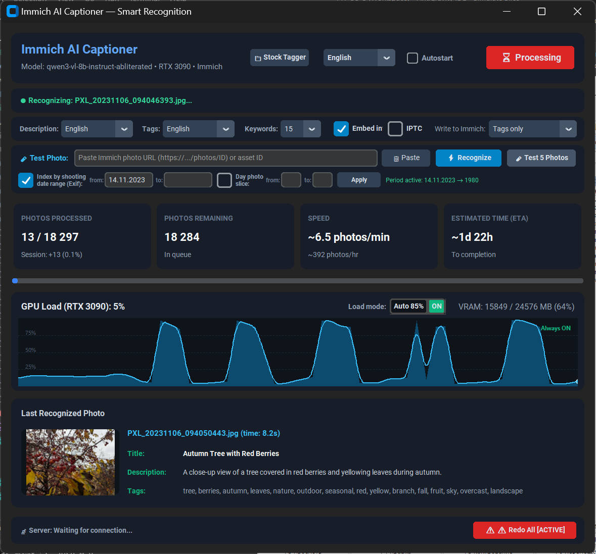
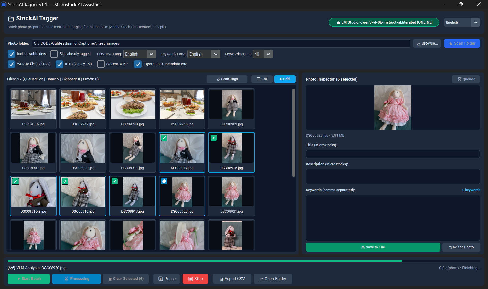

# 📷 AI Media Utilities: Immich Captioner & StockAI Tagger

> **Autonomous AI-powered visual analysis, commercial metadata generation, and permanent IPTC/XMP tagging using local Vision LLMs (LM Studio, Qwen-VL, Gemma) and ExifTool.**
>
> 🇷🇺 **Автономное AI-распознавание, генерация коммерческих метаданных и вшивание IPTC/XMP для Immich и фотостоков с помощью локальных Vision LLM и ExifTool.**

[](LICENSE)
[](https://www.python.org/)
[](https://github.com/TomSchimansky/CustomTkinter)
[](https://exiftool.org/)
[](#-8-language-multilingual-support)
[](https://github.com/SaidAuita/Immich-AI-Captioner/releases)

[📖 Читать документацию на русском языке (Russian version)](README_ru.md) | [📦 Download Ready-to-Run Binaries (.EXE)](https://github.com/SaidAuita/Immich-AI-Captioner/releases)

---

This repository contains production-ready modules for privacy-first, local AI image analysis, professional microstock metadata management, and native server-side metadata embedding:

1. **[Immich AI Captioner (Standalone)](#-1-immich-ai-captioner-standalone)** — Automatic recognition, contextual description, and keyword tagging for your self-hosted [Immich](https://immich.app/) photo library.
2. **[StockAI Tagger](#-2-stockai-tagger)** — Professional desktop workstation for microstock batch captioning, commercial headline generation, keyword tagging (25–50 tags), and ExifTool IPTC/XMP metadata embedding.
3. **[Server Metadata Daemon (`apply_metadata.py`)](#-3-server-metadata-daemon-apply_metadatapy)** — Linux background worker daemon for high-performance, native IPTC/XMP/EXIF embedding directly on your host server or NAS via ExifTool.

---

## 📸 1. Immich AI Captioner (Standalone)

<p align="center">
  
</p>

### 🌟 Why Immich AI Captioner?

[Immich](https://immich.app/) is the leading self-hosted photo management system. However, its native CLIP search has limitations with precise object recognition, text OCR, and scene descriptions. Furthermore, metadata stored exclusively in the PostgreSQL database can be lost during system migrations.

### Key Capabilities:
* **Direct Immich REST API Client**: Connects directly to your Immich instance via API Key — no server modifications, custom Docker images, or restarts required.
* **Deep Scene Understanding**: Local Vision LLMs (e.g. `Qwen2.5-VL-7B`, `Qwen3-VL-8B`, `Gemma-3-4B` via LM Studio) produce precise titles, natural descriptions, and contextual keywords.
* **Smart Shooting Date Range Indexing**:
  * Enter a single start date to continue indexing downwards in time (from newest to oldest, down to 1980) without scanning recent, already processed pages.
  * Define bounded date ranges (e.g., specific year or month).
  * Optional *Photo Slice* mode to sample top N photos per day (e.g. photos 1–5 daily) for curated daily summaries.
* **Intelligent GPU Throttling**: Real-time GPU load graph with `Auto 85%` mode (automatically pauses when gaming or 3D rendering) and `ON` mode (continuous processing).
* **Duplicate Process Guard**: Single-instance engine automatically cleans up stale background processes on launch and guarantees clean termination on exit.
* **8-Language Multilingual Engine**: Full GUI and prompt localization across 8 languages (EN, RU, DE, FR, ES, PT, JA, ZH) with independent language selection for descriptions and tags.
* **Optional ExifTool Sync**: Embed metadata directly into original image files or sidecar `.xmp` files.

---

## 🏷️ 2. StockAI Tagger

<p align="center">
  
</p>

### 🌟 Why StockAI Tagger?

StockAI Tagger is a standalone workstation built specifically for microstock contributors (Adobe Stock, Shutterstock, Getty/iStock, Freepik) and digital asset managers who need commercial-grade metadata without cloud subscription costs.

### Key Capabilities:
* **Microstock Compliance Standards**:
  * **Title**: Punchy commercial headline (5–15 words).
  * **Description**: Accurate narrative describing context, subject, and composition (10–30 words).
  * **Keywords**: 25 to 50 ordered, deduplicated, and highly relevant tags.
* **Dual Browsing Interfaces**:
  * **List / Table View**: Detailed grid displaying filename, resolution, capture date, status badge, and embedded tags.
  * **Thumbnail Grid View**: Proportional aspect-ratio cards with smooth vertical scrolling and visual completion badges.
* **Rapid Metadata Scanner**: Inspects all folder files in seconds in the background, instantly separating indexed images from unindexed ones.
* **Range Multi-Selection & Targeted Tagging**:
  * `Shift + Click` range selection and `Ctrl + Click` individual toggles.
  * Dynamic batch execution button: `⚡ Tag Selected (N)`.
* **Metadata Wiper / Cleaner**: One-click stripping of Title, Description, and Keywords from EXIF, IPTC, and XMP blocks (and sidecar `.xmp` files) for selected images or full folders.
* **Embedded Portable ExifTool**: Bundled self-contained ExifTool distribution — runs anywhere out of the box with zero runtime setup.
* **Microstock CSV Export**: One-click export to standard CSV format ready for stock submission portals.

---

## 🖥️ 3. Server Metadata Daemon: apply_metadata.py

<p align="center">
  
</p>

For guaranteed, high-performance embedding of IPTC, XMP, and EXIF metadata directly into your Immich media archive without network file-locking or SMB bottlenecks, this repository includes an autonomous Linux/NAS background daemon.

### 🌟 Why Run the Server Daemon?
* **Native Disk I/O**: ExifTool runs locally on the host disks (NVMe/SATA), eliminating the transfer of gigabytes of media across the LAN.
* **Direct File Injection**: Updates `.jpg`, `.jpeg`, `.png`, `.webp`, and `.tif` files with strict UTF-8 IPTC/XMP and preserves original timestamps (`-preserve`).
* **Sidecar .XMP Support**: Creates or updates standard `.xmp` sidecar files for RAW photos (CR2, CR3, NEF, ARW, DNG) and video files.
* **Decoupled Queue Architecture**: The client on Windows/Mac simply drops lightweight JSON tasks into a shared `queue/` folder (SMB/NFS/DropSync).

### 🚀 Quick Server Installation (Single Command):

```bash
# 1. Create directory and copy server files:
sudo mkdir -p /opt/immich-metadata
sudo cp apply_metadata.py immich-metadata-worker.service install_service.sh /opt/immich-metadata/
cd /opt/immich-metadata

# 2. Run automated installer:
sudo bash install_service.sh
```

### ⚙️ Service Management:
```bash
sudo systemctl status immich-metadata-worker      # Check status
sudo journalctl -u immich-metadata-worker -f      # Live logs
sudo systemctl restart immich-metadata-worker     # Restart service
sudo systemctl stop immich-metadata-worker        # Stop service
```

> 📖 **[Comprehensive Server Metadata Daemon Setup Guide](doc/SERVER_SETUP_EN.md)** — detailed guide covering architecture, permission troubleshooting, and custom Immich storage paths.

---

## ⚡ Quick Start

### 1. Requirements
* **Vision LLM Server**: [LM Studio](https://lmstudio.ai/) running locally on your PC or LAN.
  * Recommended models: `qwen2.5-vl-7b-instruct`, `qwen3-vl-8b-instruct`, or `gemma-3-4b-it`.
  * Start local server at `http://localhost:1234/v1`.

### 2. Running Immich AI Captioner
1. Download `ImmichAI_Captioner_Standalone.exe` from [Releases](https://github.com/SaidAuita/Immich-AI-Captioner/releases).
2. Copy `config.example.json` to `config.json` next to the executable and fill in your Immich URL and API key.
3. Launch `ImmichAI_Captioner_Standalone.exe` and click **▶ Start**!

### 3. Running StockAI Tagger
1. Download `StockAI_Tagger_v1.1_Windows_x64.zip` from [Releases](https://github.com/SaidAuita/Immich-AI-Captioner/releases) and extract it.
2. Launch `StockAI_Tagger.exe`.
3. Select your image folder, choose your target languages and tag count, and click **⚡ Tag Unindexed** or select specific photos!

---

## 🌐 8-Language Multilingual Support

Both tools support full multilingual localization with live language switching in the GUI:
* 🇬🇧 English (`en`)
* 🇷🇺 Русский (`ru`)
* 🇩🇪 Deutsch (`de`)
* 🇫🇷 Français (`fr`)
* 🇪🇸 Español (`es`)
* 🇵🇹 Português (`pt`)
* 🇯🇵 日本語 (`ja`)
* 🇨🇳 简体中文 (`zh`)

---

## 🛠️ Building From Source

```bash
# Clone the repository
git clone https://github.com/SaidAuita/Immich-AI-Captioner.git
cd Immich-AI-Captioner

# Install dependencies
pip install -r requirements.txt

# Run Immich AI Captioner GUI
python ui_app.py

# Run StockAI Tagger GUI
python stock_tagger_app.py

# Compile Immich AI Captioner Standalone Executable
python -m PyInstaller --noconfirm ImmichAI_Captioner_Standalone.spec

# Compile StockAI Tagger Portable Distribution (with bundled ExifTool)
python build_stock_tagger.py
```

---

## 🛠️ Other Projects

**[Free Automation Tools & Utilities](https://ph-cu-s.com/tools)**  
* Free open-source scripts, extensions, and desktop utilities for Adobe Illustrator, InDesign, Photoshop, and Windows performance optimization.

**[RyzenQuiet PRO](https://github.com/SaidAuita/RyzenQuietPro)**  
* Lightweight hardware HUD monitor, acoustic fan controller, and CPU/GPU power-limiting utility for AMD Ryzen & Windows.

**[ComfyUI Photoshop Plugin (PH-CU-S)](https://github.com/SaidAuita/ComfyUI_PH-CU-S)**  
* Professional Photoshop plugin powered by ComfyUI, providing direct integration with local generative models.

**[AI Dimension](https://github.com/SaidAuita/AI-Dimension)**  
* Automatic technical dimensioning, bounds, leader lines, and drafting scales extension for Adobe Illustrator.

**[ID Dimension](https://github.com/SaidAuita/ID-Dimension)**  
* Automatic technical dimensioning, bounds, leader lines, and drafting scales for Adobe InDesign.

---

## 📄 License

This project is licensed under the [MIT License](LICENSE).  
Immich is a trademark of its respective owners and this independent community utility is not affiliated with the core Immich team.
