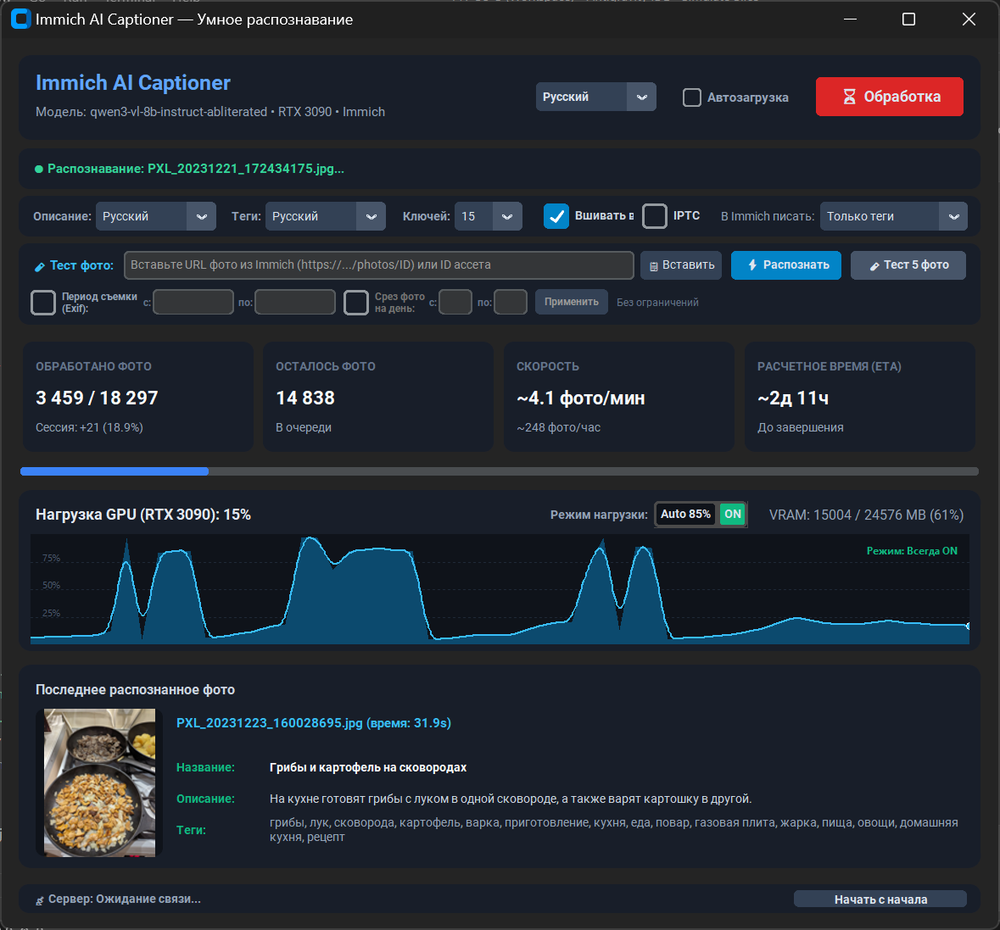
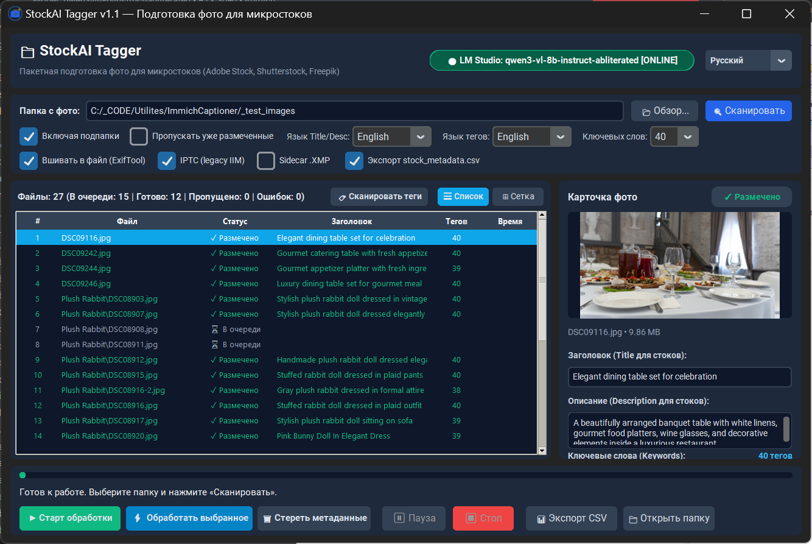

# 📷 AI Media Utilities: Immich Captioner & StockAI Tagger

> **Автономное нейросетевое распознавание изображений (VLM), генерация коммерческих метаданных и вечное вшивание IPTC/XMP с помощью локальных моделей (LM Studio, Qwen-VL, Gemma) и ExifTool.**
>
> 🇬🇧 **Autonomous AI-powered visual analysis, commercial metadata generation, and permanent IPTC/XMP tagging using local Vision LLMs and ExifTool.**

[](LICENSE)
[](https://www.python.org/)
[](https://github.com/TomSchimansky/CustomTkinter)
[](https://exiftool.org/)
[](#-мультиязычность-8-языков)
[](https://github.com/SaidAuita/Immich-AI-Captioner/releases)

[📖 Read documentation in English](README.md) | [📦 Скачать готовые исполняемые файлы (.EXE)](https://github.com/SaidAuita/Immich-AI-Captioner/releases)

---

В этом репозитории представлены модули для локального анализа изображений, профессиональной работы со стоковыми метаданными и серверного вшивания метаданных без передачи файлов в сторонние облака:

1. **[Immich AI Captioner (Standalone)](#-1-immich-ai-captioner-standalone)** — Автоматическое распознавание, генерация описаний и тегов для персональной фотобиблиотеки [Immich](https://immich.app/).
2. **[StockAI Tagger](#-2-stockai-tagger)** — Профессиональная рабочая станция для пакетного тегирования стоковых фото, генерации коммерческих заголовков, 25–50 ключевых слов и вшивания IPTC/XMP метаданных через ExifTool.
3. **[Серверный демон метаданных (`apply_metadata.py`)](#-3-серверный-демон-метаданных-apply_metadatapy)** — Фоновая Linux-служба для высокоскоростного вшивания IPTC/XMP/EXIF прямо на сервере или NAS через ExifTool.

---

## 📸 1. Immich AI Captioner (Standalone)

<p align="center">
  
</p>

### 🌟 Какую проблему решает Immich AI Captioner?

[Immich](https://immich.app/) — прекрасный self-hosted сервер для хранения фото и видео. Однако встроенный поиск CLIP имеет ограничения при поиске конкретных предметов, текста на фото и точных сцен. Кроме того, при хранении метаданных только в базе PostgreSQL существует риск их утраты при миграции.

### Ключевые возможности:
* **Прямой REST API клиент Immich**: Подключается к вашему серверу Immich по API-ключу — не требует правок Docker Compose, сторонних контейнеров или перезапуска сервера.
* **Глубокий анализ изображений**: Локальные Vision LLM (например, `Qwen2.5-VL-7B`, `Qwen3-VL-8B`, `Gemma-3-4B` в LM Studio) создают точные названия, естественные описания и поисковые ключевые слова.
* **Умная фильтрация по датам съемки (Exif Date)**:
  * Ввод одной даты запускает индексацию **вниз во времени к 1980 году** (от новых к старым) без долгого предварительного сканирования свежих страниц архива.
  * Возможность точного ограничения диапазона дат (конкретный год или месяц).
  * Режим *Photo Slice* для выборки первых N фото каждого дня (например, 1–5 кадров в день) для быстрого обзора архива.
* **Адаптивный троттлинг GPU**: Монитор нагрузки видеокарты с режимом `Auto 85%` (автоматическая пауза во время 3D-игр или рендеринга) и режимом `ON` (непрерывная работа).
* **Автоматическая защита от дублей**: При запуске приложение находит и закрывает любые старые зависшие процессы, а при выходе гарантирует полное освобождение ресурсов.
* **Мультиязычный движок (8 языков)**: Полная локализация интерфейса и промптов (RU, EN, DE, FR, ES, PT, JA, ZH) с возможностью независимого выбора языка описания и языка тегов.
* **Опциональная синхронизация с ExifTool**: Вшивание метаданных прямо в исходные файлы фотоархива или sidecar-файлы `.xmp`.

---

## 🏷️ 2. StockAI Tagger

<p align="center">
  
</p>

### 🌟 Какую проблему решает StockAI Tagger?

StockAI Tagger — специализированное рабочее место для фотографов, иллюстраторов, стокеров (Adobe Stock, Shutterstock, Getty/iStock, Freepik) и контент-менеджеров, которым необходимо быстрое и качественное коммерческое атрибутирование изображений без ежемесячных подписок на облачные сервисы.

### Ключевые возможности:
* **Стандарты коммерческих микростоков**:
  * **Title**: Лаконичный коммерческий заголовок (5–15 слов).
  * **Description**: Точное сюжетное описание композиции и контекста (10–30 слов).
  * **Keywords**: От 25 до 50 отсортированных по релевантности и очищенных от повторов ключевых слов.
* **Два режима навигации**:
  * **Таблица (List)**: Детальный список с именем файла, разрешением, датой съемки, статусом и текущими тегами.
  * **Сетка превью (Grid)**: Адаптивные карточки с сохранением оригинальных пропорций кадров, плавной вертикальной прокруткой и бейджами готовности.
* **Мгновенное сканирование папки**: Фоновая проверка всех файлов директории за несколько секунд для разделения файлов на готовые и требующие обработки.
* **Продвинутый мультиселект и пакетные действия**:
  * Выделение диапазонов через `Shift + Click` и точечный выбор через `Ctrl + Click`.
  * Динамическая кнопка пакетной обработки только выделенных кадров: `⚡ Обработать выделенные (N)`.
* **Очистка и стирание метаданных**: Удаление Title, Description и Keywords из блоков EXIF, IPTC и XMP (а также sidecar-файлов `.xmp`) для выбранных файлов или всей директории в один клик.
* **Встроенный переносимый ExifTool**: В дистрибутив уже включен полнофункциональный переносимый ExifTool — приложение работает сразу после распаковки.
* **Экспорт в CSV для стоков**: Экспорт метаданных обработанных кадров в стандартную таблицу CSV для быстрой загрузки через порталы авторов.

---

## 🖥️ 3. Серверный демон метаданных: apply_metadata.py

<p align="center">
  
</p>

Для гарантированного вшивания метаданных IPTC/XMP/EXIF в исходные файлы библиотеки Immich без передачи гигабайт фотографий по сети в проект входит автономный фоновый демон для сервера Linux или NAS (Ubuntu, Debian, TrueNAS, Unraid, Synology).

### 🌟 Преимущества серверного демона:
* **Нативная скорость I/O**: ExifTool выполняется прямо на локальных накопителях сервера (NVMe/SATA), полностью исключая задержки и блокировки протоколов SMB/NFS.
* **Прямое вшивание в файлы**: Поддерживает `.jpg`, `.jpeg`, `.png`, `.webp`, `.tif`, `.tiff` с корректной кодировкой UTF-8 и сохранением даты изменения (`-preserve`).
* **Sidecar .XMP**: Для RAW-форматов (CR2, CR3, NEF, ARW, DNG) и видео создаются или обновляются прилежащие файлы `.xmp`.
* **Автономная очередь**: Десктопный клиент на Windows/Mac отправляет лишь компактные JSON-файлы с метаданными в сетевую папку `queue/`.

### 🚀 Быстрая установка на сервере (в 1 команду):

```bash
# 1. Создайте каталог и скопируйте серверные файлы:
sudo mkdir -p /opt/immich-metadata
sudo cp apply_metadata.py immich-metadata-worker.service install_service.sh /opt/immich-metadata/
cd /opt/immich-metadata

# 2. Запустите автоматический установщик:
sudo bash install_service.sh
```

### ⚙️ Команды управления службой:
```bash
sudo systemctl status immich-metadata-worker      # Проверить статус
sudo journalctl -u immich-metadata-worker -f      # Просмотр логов в реальном времени
sudo systemctl restart immich-metadata-worker     # Перезапуск службы
sudo systemctl stop immich-metadata-worker        # Остановка службы
```

> 📖 **[Полное руководство по установке и настройке сервера метаданных](doc/SERVER_SETUP_RU.md)** — подробная документация с диаграммой архитектуры, настройкой прав доступа и кастомных путей библиотек Immich.

---

## ⚡ Быстрый старт


### 1. Требования
* **Сервер локальных нейросетей**: [LM Studio](https://lmstudio.ai/) запущенный на вашем ПК с видеокартой NVIDIA.
  * Рекомендуемые модели зрения: `qwen2.5-vl-7b-instruct`, `qwen3-vl-8b-instruct` или `gemma-3-4b-it`.
  * Запустите локальный сервер по адресу `http://localhost:1234/v1`.

### 2. Запуск Immich AI Captioner
1. Скачайте `ImmichAI_Captioner_Standalone.exe` из раздела [Releases](https://github.com/SaidAuita/Immich-AI-Captioner/releases).
2. Скопируйте `config.example.json` в `config.json` рядом с файлом программы и укажите URL и API-ключ Immich.
3. Запустите `ImmichAI_Captioner_Standalone.exe` и нажмите **▶ Старт**!

### 3. Запуск StockAI Tagger
1. Скачайте архив `StockAI_Tagger_v1.1_Windows_x64.zip` из раздела [Releases](https://github.com/SaidAuita/Immich-AI-Captioner/releases) и распакуйте его в удобную папку.
2. Запустите `StockAI_Tagger.exe`.
3. Укажите рабочую папку с изображениями, настройте желаемые языки и количество тегов, и нажмите **⚡ Тегировать неразмеченные** или выберите нужные кадры!

---

## 🌐 Мультиязычность (8 языков)

Оба приложения полностью переведены и поддерживают переключение интерфейса на лету:
* 🇷🇺 Русский (`ru`)
* 🇬🇧 English (`en`)
* 🇩🇪 Deutsch (`de`)
* 🇫🇷 Français (`fr`)
* 🇪🇸 Español (`es`)
* 🇵🇹 Português (`pt`)
* 🇯🇵 日本語 (`ja`)
* 🇨🇳 简体中文 (`zh`)

---

## 🛠️ Сборка из исходников

```bash
# Клонирование репозитория
git clone https://github.com/SaidAuita/Immich-AI-Captioner.git
cd Immich-AI-Captioner

# Установка зависимостей
pip install -r requirements.txt

# Запуск интерфейса Immich AI Captioner
python ui_app.py

# Запуск интерфейса StockAI Tagger
python stock_tagger_app.py

# Сборка единого EXE-файла Immich AI Captioner Standalone
python -m PyInstaller --noconfirm ImmichAI_Captioner_Standalone.spec

# Сборка портативного релиза StockAI Tagger (включая ExifTool)
python build_stock_tagger.py
```

---

## 🛠️ Другие проекты автора

**[Бесплатные скрипты и утилиты автоматизации](https://ph-cu-s.com/tools)**  
* Открытые скрипты, панели и утилиты для Adobe Illustrator, InDesign, Photoshop и оптимизации работы в Windows.

**[RyzenQuiet PRO](https://github.com/SaidAuita/RyzenQuietPro)**  
* Утилита для аппаратного мониторинга, акустического управления вентиляторами и ограничения мощности процессоров AMD Ryzen.

**[Плагин ComfyUI для Photoshop (PH-CU-S)](https://github.com/SaidAuita/ComfyUI_PH-CU-S)**  
* Профессиональный плагин Photoshop с интеграцией генеративных нейросетей через ComfyUI.

**[AI Dimension](https://github.com/SaidAuita/AI-Dimension)**  
* Расширение автоматического чертёжного образмеривания и расстановки выносок для Adobe Illustrator.

**[ID Dimension](https://github.com/SaidAuita/ID-Dimension)**  
* Расширение автоматического образмеривания и масштабирования для Adobe InDesign.

---

## 📄 Лицензия

Проект распространяется под лицензией [MIT](LICENSE).  
Immich является товарным знаком соответствующих владельцев; данная утилита является независимой разработкой сообщества.
