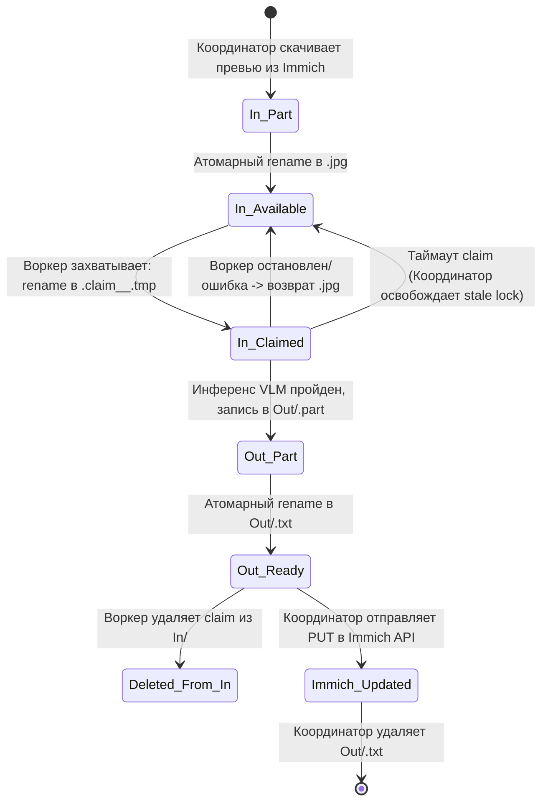

# Архитектура ImmichCaptioner

В проекте реализовано два режима работы: **Standalone (Прямой)** и **Distributed Queue (Распределённая очередь)**. Ниже детально описано внутреннее устройство обоих режимов, жизненный цикл задач, механизмы блокировок и структуры данных.

---

## 1. Сравнение режимов

```
+-----------------------------------------------------------------------------------+
| 1. STANDALONE РЕЖИМ (ui_app.py / ImmichCaptioner.exe)                            |
|                                                                                   |
|  [ Immich Server ] <===== (REST API: get assets / upload desc) =====> [ Client ]  |
|                                                                             |     |
|                                                                  [ LM Studio VLM ]|
+-----------------------------------------------------------------------------------+

+-----------------------------------------------------------------------------------+
| 2. DISTRIBUTED QUEUE РЕЖИМ (Сетевая модель)                                       |
|                                                                                   |
|  [ Immich Server ]                                                                |
|         ^                                                                         |
|         | REST API                                                                |
|         v                                                                         |
|  [ coordinator.py ] <=== Наполнение / Чтение ===> [ Сетевая шара CaptionQueue ]  |
|                                                          |          |             |
|                              SMB / NFS файл. протокол    |          |             |
|                                                          v          v             |
|                                                    [ Worker 1 ] [ Worker 2 ]      |
|                                                          |          |             |
|                                                    [ LM Studio ][ LM Studio ]     |
+-----------------------------------------------------------------------------------+
```

### Преимущества распределённого режима:
1. **Безопасность API-ключа**: Рабочим станциям не требуется доступ к Immich API или API-ключ администратора. Они видят только файлы картинок в сетевой папке.
2. **Горизонтальное масштабирование**: Можно запустить несколько ПК с видеокартами (например, домашний ПК + рабочий ноутбук). Они будут параллельно разбирать одну очередь без конфликтов.
3. **Отказоустойчивость**: Если воркер зависнет или выключится, задача вернётся в очередь либо будет сброшена координатором по таймауту (`stale_claim_timeout_minutes`).
4. **Независимость от ОС**: Координатор может работать на безголовом Linux/FreeNAS/Unraid сервере, а воркер — на мощном Windows-ПК с видеокартой GeForce RTX.

---

## 2. Протокол файловой очереди (CaptionQueue)

Вся координация между координатором и воркерами происходит через файловую систему (SMB/NFS/локальный каталог):

```
CaptionQueue/
├── In/                          # Входящие задачи (фото, требующие описания)
│   ├── <asset-id-1>.jpg         # Свободная задача, готова к взятию
│   ├── <asset-id-2>.claim_said-home_1727210000.tmp  # Захвачена воркером "said-home"
│   └── <asset-id-3>.part        # В процессе скачивания координатором
└── Out/                         # Готовые результаты (описания)
    ├── <asset-id-4>.part        # В процессе записи воркером
    └── <asset-id-4>.txt         # Готовый результат (описание UTF-8)
```

### Жизненный цикл задачи (State Machine)



### Детали атомарности операций:
1. **Защита от частичной записи (torn write)**:
   - Координатор пишет картинку в `.part`, а затем вызывает `os.replace(".part", ".jpg")`. Воркер видит файл только тогда, когда он целиком записан на диск.
   - Воркер пишет описание в `Out/<id>.part`, а затем вызывает `os.replace(".part", ".txt")`. Координатор видит результат только в готовом виде.
2. **Атомарный захват задачи (Atomic Claim)**:
   - Воркер ищет первый свободный `.jpg` в `In/`.
   - Выполняется попытка `os.rename("In/<id>.jpg", "In/<id>.claim_<worker_id>_<timestamp>.tmp")`.
   - В POSIX и Windows NTFS операция rename файла в пределах одного тома атомарна. Если несколько воркеров одновременно попытаются переименовать один и тот же файл, только один получит успех, а остальные получат `OSError` / `FileNotFoundError` и мгновенно перейдут к следующему файлу.
3. **Очистка зависших блокировок (Stale Claim Recovery)**:
   - Если воркер аварийно завершился (BSOD, отключение питания, сбой сети), в папке `In/` останется `.claim_<worker_id>_<timestamp>.tmp`.
   - Координатор раз в цикл проверяет метку времени `<timestamp>` в имени файла. Если прошло больше `stale_claim_timeout_minutes` (по умолчанию 15 минут), координатор переименовывает файл обратно в `.jpg`, возвращая его в общую очередь.

---

## 3. Компоненты системы

### 1. `coordinator.py`
- Опрашивает Immich API (`GET /api/search/metadata?hasExif=true` или поиск фото без описания).
- Поддерживает буфер в папке `In/` (параметр `buffer_target`, по умолчанию 60 фото). Не скачивает весь архив сразу, экономя диск.
- Скачивает превью фото через `GET /api/assets/{id}/thumbnail?size=preview`.
- Следит за папкой `Out/`. При появлении `<id>.txt` считывает описание и вызывает `PUT /api/assets/{id}` в Immich.
- Ведёт локальное состояние в `coordinator_state.json` (список обработанных и пропущенных ID, предотвращая повторные запросы).

### 2. `ui_worker.py` / `ImmichCaptionWorker.exe`
- Графический клиент для рабочих станций Windows.
- Читает `worker_config.json`.
- Мониторит очередь `CaptionQueue/In` и локальный инференс LM Studio.
- Оснащён системой фонового троттлинга (`gpu_monitor.py`), отслеживает GPU Load, VRAM, активные игры/программы.
- Имеет интеграцию с Windows System Tray и автозапуском.

### 3. `file_worker.py`
- Консольный безголовый (headless) аналог воркера для серверов, Linux-машин или фонового запуска без GUI.

### 4. `captioner.py` (`VlmCaptioner`)
- Модуль взаимодействия с LM Studio через OpenAI-совместимый эндпоинт `/v1/chat/completions`.
- Содержит специализированный системный промпт на русском языке:
  - Структурированное описание сцены.
  - Поиск и выделение надписей и номеров в кавычках.
  - Строка поисковых тегов: `Теги: ...`.
- Очистка служебных токенов (например `<think>...</think>` в reasoning-моделях).

### 5. `gpu_monitor.py`
- Телеметрия через вызов утилиты `nvidia-smi` (нагрузка GPU в %, занятая/общая VRAM в MB).
- Определение времени простоя пользователя через Win32 API (`GetLastInputInfo`).
- Проверка запущенных тяжёлых процессов через `tasklist`.
