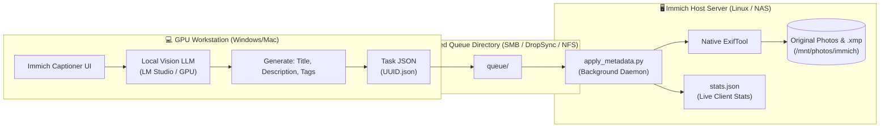

# 🖥️ Server Metadata Daemon Setup & Installation Guide

> **Server-side background worker daemon (`apply_metadata.py`) for guaranteed, native embedding of IPTC, XMP, and EXIF metadata directly into Immich media files using ExifTool.**

---

## 📌 Why is the Server Component Needed?

When running [Immich](https://immich.app/), your primary photo library is hosted on a home server, NAS (Ubuntu Server, Debian, TrueNAS, Unraid, Synology), or network-attached storage.

Attempting to inject metadata directly over SMB or NFS from a remote workstation presents notable bottlenecks:
* High network latency and slow I/O when reading and rewriting large RAW or high-resolution JPEG files.
* File locking issues and network timeouts.
* Linux filesystem permission conflicts when files are mounted from Windows.

**The Immich Captioner Architecture:**
The workload is divided into two decoupled roles:
1. **GPU Workstation (Client on Windows/Mac)**: Executes heavy Vision LLM inference (LM Studio / Qwen-VL / Gemma) using a dedicated GPU and emits lightweight JSON tasks.
2. **Immich Server (Background Daemon `apply_metadata.py`)**: Runs directly on the server next to the photo storage disks, consumes tasks from the queue, and writes metadata with native NVMe/SATA disk performance via **ExifTool**.



---

## 🛠️ Supported Metadata Standards & Formats

* **Direct File Embedding** (`.jpg`, `.jpeg`, `.png`, `.webp`, `.tif`, `.tiff`):
  * **Titles**: `XMP-dc:Title`, `XMP-photoshop:Headline`, `IPTC:Headline`, `IPTC:ObjectName`, `EXIF:XPTitle`.
  * **Descriptions**: `XMP-dc:Description`, `IPTC:Caption-Abstract`, `EXIF:ImageDescription`.
  * **Keywords**: `XMP-dc:Subject`, `XMP-lr:hierarchicalSubject`, `IPTC:Keywords`, `EXIF:XPKeywords`.
  * Encoding: Strict **UTF-8** (`-charset iptc=utf8 -codedcharacterset=utf8`).
  * Preserves original file modification timestamps: `-overwrite_original -preserve`.
* **Sidecar `.xmp` Files** for RAW images and videos (`.raw`, `.cr2`, `.cr3`, `.nef`, `.arw`, `.dng`, `.mp4`, `.mov`, `.mkv`, etc.):
  * Generates or updates the adjacent `<filename>.xmp` file, natively indexed by Immich, Adobe Lightroom, Darktable, and DigiKam.

---

## 🚀 Step-by-Step Server Installation

### Step 1. Copy Files to the Server

Transfer the server daemon files to your preferred directory (for instance, `/opt/immich-metadata`):

```bash
sudo mkdir -p /opt/immich-metadata
# Copy: apply_metadata.py, immich-metadata-worker.service, install_service.sh
sudo cp apply_metadata.py immich-metadata-worker.service install_service.sh /opt/immich-metadata/
cd /opt/immich-metadata
```

---

### Step 2. Automated Installation via Script

Run the automated installer:
```bash
sudo bash install_service.sh
```

The script will automatically:
1. Detect and install `exiftool` (`libimage-exiftool-perl`) and `python3`.
2. Create the required directories: `queue/`, `done/`, `errors/`, `commands/`.
3. Register and start the `immich-metadata-worker.service` systemd unit.

---

### Step 3. Manual Installation (Alternative)

If you prefer installing manually without the script:

1. **Install ExifTool and Python 3**:
   ```bash
   # Ubuntu / Debian
   sudo apt update && sudo apt install -y libimage-exiftool-perl python3

   # Arch Linux
   sudo pacman -S perl-image-exiftool python

   # Fedora / RHEL
   sudo dnf install -y perl-Image-ExifTool python3
   ```

2. **Initialize queue folders**:
   ```bash
   cd /opt/immich-metadata
   mkdir -p queue done errors commands
   chmod -R 777 queue done errors commands
   ```

3. **Configure the Immich Library Path (Optional)**:
   By default, the daemon scans:
   * `/mnt/photos/immich/upload`
   * `/mnt/photos/immich`
   * `/mnt/photos`

   If your Immich upload library is mounted at a custom path, configure the environment variable in `/etc/systemd/system/immich-metadata-worker.service`:
   ```ini
   [Service]
   Environment=IMMICH_PHOTOS_DIR=/path/to/immich/library
   ```

4. **Start and enable the service**:
   ```bash
   sudo cp immich-metadata-worker.service /etc/systemd/system/
   sudo systemctl daemon-reload
   sudo systemctl enable --now immich-metadata-worker.service
   ```

---

## 📊 Service Management & Troubleshooting

| Operation | Command |
| :--- | :--- |
| **Check service status** | `sudo systemctl status immich-metadata-worker` |
| **View live logs** | `sudo journalctl -u immich-metadata-worker -f` |
| **Restart service** | `sudo systemctl restart immich-metadata-worker` |
| **Stop service** | `sudo systemctl stop immich-metadata-worker` |
| **Daemon log file** | `tail -f /opt/immich-metadata/worker.log` |
| **Live statistics** | `cat /opt/immich-metadata/stats.json` |

---

## 🔄 Self-Updating & Remote Management

`apply_metadata.py` includes robust continuous-operation features:
1. **Hot-Reloading**: If `apply_metadata.py` is updated on disk (via git pull or file sync), the process automatically reloads itself without dropping queue tasks.
2. **Remote Restart**: Placing an empty file at `commands/restart.cmd` signals the daemon to cleanly restart.

---

## 🔗 Client Configuration (Windows / Mac)

In **Immich AI Captioner** or in `config.json`, provide the network path to the queue folder:

* **SMB UNC Path (Windows)**:
  `\\192.168.1.4\Exchange\ImmichMetadata\queue`
* **NFS / SMB Mount (Linux / macOS)**:
  `/Volumes/Exchange/ImmichMetadata/queue`

When you press **▶ Start**, the client immediately dispatches generated captions and keywords to the server queue, where native ExifTool injects them directly into your originals!
