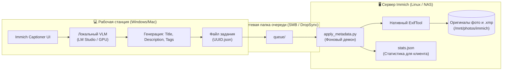

# 🖥️ Руководство по установке и настройке сервера метаданных (Server Metadata Daemon)

> **Серверный фоновый демон (`apply_metadata.py`) для гарантированного вшивания метаданных IPTC, XMP и EXIF в оригинальные файлы фотоархива Immich с помощью ExifTool.**

---

## 📌 Зачем нужна серверная часть?

При работе с [Immich](https://immich.app/) фотоархив хранится на домашнем сервере, NAS (Ubuntu Server, Debian, TrueNAS, Unraid, Synology) или в сетевом хранилище.

Попытка изменять метаданные файлов удалённо с рабочего компьютера по сетевому протоколу SMB/NFS сопряжена с рядом проблем:
* Медленная скорость по сети при чтении и перезаписи тяжёлых файлов.
* Блокировки файлов и сетевые задержки.
* Конфликты прав доступа файловой системы Linux при монтировании через Windows.

**Решение архитектуры Immich Captioner:**
Разделение задач на две независимые роли:
1. **Рабочая станция с GPU (Клиент на Windows/Mac)**: Выполняет тяжелый анализ изображений через локальную нейросеть (LM Studio / Qwen-VL / Gemma) и формирует компактные JSON-задания.
2. **Сервер Immich (Фоновый демон `apply_metadata.py`)**: Работает прямо на сервере рядом с файлами фотоархива, подхватывает задачи из очереди и через нативный **ExifTool** со скоростью локального накопителя (NVMe/SATA) вшивает метаданные в оригиналы без сетевых задержек.



---

## 🛠️ Поддерживаемые форматы и стандарты

* **Прямое вшивание в файлы** (`.jpg`, `.jpeg`, `.png`, `.webp`, `.tif`, `.tiff`):
  * **Заголовки**: `XMP-dc:Title`, `XMP-photoshop:Headline`, `IPTC:Headline`, `IPTC:ObjectName`, `EXIF:XPTitle`.
  * **Описания**: `XMP-dc:Description`, `IPTC:Caption-Abstract`, `EXIF:ImageDescription`.
  * **Ключевые слова**: `XMP-dc:Subject`, `XMP-lr:hierarchicalSubject`, `IPTC:Keywords`, `EXIF:XPKeywords`.
  * Кодировка: строго **UTF-8** (`-charset iptc=utf8 -codedcharacterset=utf8`).
  * Сохранение даты изменения файла: `-overwrite_original -preserve`.
* **Sidecar-файлы `.xmp`** для RAW-форматов и видео (`.raw`, `.cr2`, `.cr3`, `.nef`, `.arw`, `.dng`, `.mp4`, `.mov`, `.mkv` и др.):
  * Создаёт или обновляет прилежащий файл `<имя_файла>.xmp`, полностью поддерживаемый Immich, Lightroom, Darktable и DigiKam.

---

## 🚀 Пошаговая установка на сервере

### Шаг 1. Перенос файлов на сервер

Скопируйте файлы серверного демона в удобный каталог на сервере (например, `/opt/immich-metadata` или в каталог сетевой папки):

```bash
sudo mkdir -p /opt/immich-metadata
# Скопируйте файлы: apply_metadata.py, immich-metadata-worker.service, install_service.sh
sudo cp apply_metadata.py immich-metadata-worker.service install_service.sh /opt/immich-metadata/
cd /opt/immich-metadata
```

---

### Шаг 2. Автоматическая установка через скрипт

Запустите скрипт автоматической установки:
```bash
sudo bash install_service.sh
```

Скрипт автоматически:
1. Проверит и установит `exiftool` (`libimage-exiftool-perl`) и `python3`.
2. Создаст служебные папки очереди: `queue/`, `done/`, `errors/`, `commands/`.
3. Зарегистрирует и запустит службу `immich-metadata-worker.service` в `systemd`.

---

### Шаг 3. Ручная установка (если не используется скрипт)

Если вы хотите выполнить установку вручную:

1. **Установите ExifTool и Python 3**:
   ```bash
   # Ubuntu / Debian
   sudo apt update && sudo apt install -y libimage-exiftool-perl python3

   # Arch Linux
   sudo pacman -S perl-image-exiftool python

   # Fedora / RHEL
   sudo dnf install -y perl-Image-ExifTool python3
   ```

2. **Создайте папки очереди**:
   ```bash
   cd /opt/immich-metadata
   mkdir -p queue done errors commands
   chmod -R 777 queue done errors commands
   ```

3. **Настройте путь к архиву Immich (при необходимости)**:
   По умолчанию скрипт проверяет каталоги:
   * `/mnt/photos/immich/upload`
   * `/mnt/photos/immich`
   * `/mnt/photos`

   Если ваш архив Immich смонтирован в другой путь, укажите переменную окружения в файле службы `/etc/systemd/system/immich-metadata-worker.service`:
   ```ini
   [Service]
   Environment=IMMICH_PHOTOS_DIR=/ваш/путь/к/immich/library
   ```

4. **Запустите службу**:
   ```bash
   sudo cp immich-metadata-worker.service /etc/systemd/system/
   sudo systemctl daemon-reload
   sudo systemctl enable --now immich-metadata-worker.service
   ```

---

## 📊 Управление службой и мониторинг

| Действие | Команда |
| :--- | :--- |
| **Проверка статуса** | `sudo systemctl status immich-metadata-worker` |
| **Просмотр логов онлайн** | `sudo journalctl -u immich-metadata-worker -f` |
| **Перезапуск службы** | `sudo systemctl restart immich-metadata-worker` |
| **Остановка службы** | `sudo systemctl stop immich-metadata-worker` |
| **Лог-файл демона** | `tail -f /opt/immich-metadata/worker.log` |
| **Текущая статистика** | `cat /opt/immich-metadata/stats.json` |

---

## 🔄 Автообновление и удалённый перезапуск

В `apply_metadata.py` встроены механизмы непрерывной работы:
1. **Самообновление на лету**: Если файл `apply_metadata.py` на диске обновляется (например, через DropSync или git pull), процесс автоматически перезапускается без разрыва очереди.
2. **Удалённый перезапуск**: Для перезапуска достаточно создать пустой файл `commands/restart.cmd` — демон прочитает его, удалит команду и выполнит чистый перезапуск.

---

## 🔗 Настройка клиентского приложения (Windows / Mac)

В окне **Immich AI Captioner** или в файле `config.json` укажите сетевой путь к папке очереди сервера:

* **По протоколу SMB (Windows)**:
  `\\192.168.1.4\Exchange\ImmichMetadata\queue`
* **По протоколу NFS/SMB (Linux / macOS)**:
  `/Volumes/Exchange/ImmichMetadata/queue`

Теперь при нажатии кнопки **▶ Старт** клиент будет мгновенно передавать распознанные метаданные серверу, а серверный ExifTool — надежно вшивать их прямо в файлы!
